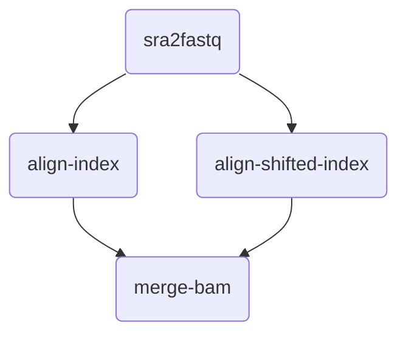

# Alpaca

## About Alpaca

Alpaca 是一个用于大规模数据分析处理的样本分发器。

## Data preparation

用户需指定样本池和任务池

### Samples

```
sample_1
sample_2
sample_3
sample_4
sample_5
sample_6
```

### Tasks

```json
{
    "name": "microbes_pipeline", 
    "pipeline": [
        {
            "name": "sra2fastq", 
            "upstream": []
        }, 
        {
            "name": "align-index", 
            "upstream": ["sra2fastq"]
        }, 
        {
            "name": "align-shifted-index", 
            "upstream": ["sra2fastq"]
        }, 
        {
            "name": "merge-bam", 
            "upstream": ["align-index", "align-shifted-index"]
        }
    ]
}
```



## Usage

启动程序

```shell
python ./alpaca.py --tasks-json-dir=./test/tasks.json --samples-list-dir=./test/samples.txt --port=10080
```

获取指定任务的样本

```shell
curl http://localhost:10080/get_sample/sra2fastq
```

