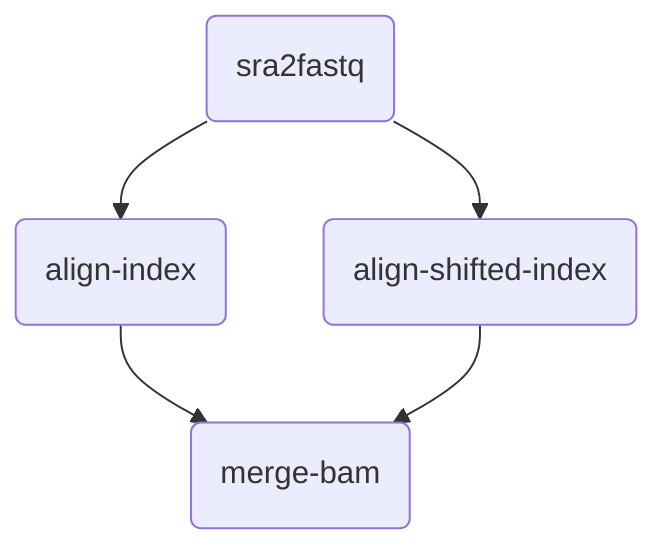

# Alpaca

## About Alpaca

Alpaca 是一个用于大规模数据分析处理的样本分发器。

## Data preparation

用户需指定样本池和任务池

### Samples

```
#SAMPLE_NAME
sample_1
sample_2
sample_3
sample_4
sample_5
sample_6
...
```

或

```
#SAMPLE_NAME	SAMPLE_DIR	GROUP	ADD
sample_1	/dir/to/sample_1	A	T
sample_2	/dir/to/sample_2	A	T
sample_3	/dir/to/sample_3	A	T
sample_4	/dir/to/sample_4	B	T
sample_5	/dir/to/sample_5	B	T
sample_6	/dir/to/sample_6	B	T
...
```

### Tasks

```json
{
    "name": "microbes_pipeline", 
    "pipeline": [
        {
            "name": "sra2fastq", 
            "upstream": []
        }, 
        {
            "name": "align-index", 
            "upstream": ["sra2fastq"]
        }, 
        {
            "name": "align-shifted-index", 
            "upstream": ["sra2fastq"]
        }, 
        {
            "name": "merge-bam", 
            "upstream": ["align-index", "align-shifted-index"]
        }
    ]
}
```



## Usage

启动程序

```shell
python ./alpaca.py --tasks-json-dir=./test/tasks.json --samples-list-dir=./test/samples.txt --port=10080
```

获取指定任务的样本

```shell
curl http://localhost:10080/get_sample/sra2fastq
```

